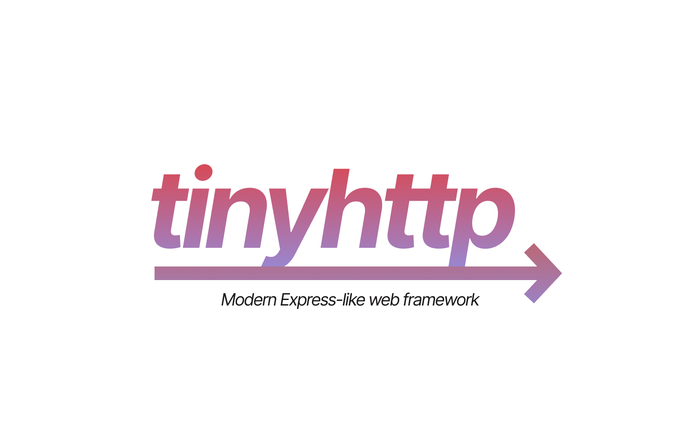

<!-- ALL-CONTRIBUTORS-BADGE:START - Do not remove or modify this section -->
[](#contributors-)
<!-- ALL-CONTRIBUTORS-BADGE:END -->

<div align="center">
<h1>tinyhttp</h1>

[](https://tinyhttp.v1rtl.site) [](twitter.com/v1rtl) [](npmjs.com/@tinyhttp/app) 
  
 [](npmjs.com/@tinyhttp/app)

<p>⚡ Tiny web framework as a replacement of Express</p>

</div>

> ⚠ The project is in development. Please don't use in production.

_**tinyhttp**_ is a modern Express-like web framework for Node.js. It uses a bare minimum amount of dependencies trying to avoid legacy hell.

Here is a short list of most important features that tinyhttp has:

- ⚙ Full Express middleware support
- ↪ Async middleware support
- 📦 8x smaller than Express
- 🏃 No legacy dependencies
- 🔨 Types out of the box
- ☑ Native ESM and CommonJS support

To get started, visit [tinyhttp website](https://tinyhttp.v1rtl.site).

## Install

tinyhttp requires [Node.js 12.4.0 or newer](https://node.green/#ES2019) or newer. It is recommended to use [pnpm](https://pnpm.js.org/) because tinyhttp reuses modules in some middlewares.

```sh
# npm
npm i @tinyhttp/app
# pnpm
pnpm i @tinyhttp/app
# yarn
yarn add @tinyhttp/app
```

## Docs

You can see the documentation [here](https://tinyhttp.v1rtl.site/docs).

## Get Started

The app structure is quite similar to Express, except that you need to import `App` from `@tinyhttp/app` instead of default import from `express`.

```ts
import { App } from '@tinyhttp/app'
import logger from '@tinyhttp/logger'

const app = new App()

app
  .use(function someMiddleware(req, res, next) {
    console.log('Did a request')
    next()
  })
  .get('/', (_, res) => {
    res.send('<h1>Hello World</h1>')
  })
  .get('/page/:page/', (req, res) => {
    res.status(200).send(`${JSON.stringify(req.params, null, 2)}`)
  })
  .use(logger())
  .listen(3000)
```

For more examples, check [examples](https://github.com/talentlessguy/tinyhttp/blob/master/examples) folder.

## Middlewares

tinyhttp offers a list of premade middleware for common tasks.

Search and explore the full list at [middleware search page](https://tinyhttp.v1rtl.site/mw).

## License

MIT © [v1rtl](https://v1rtl.site)

## Contributors ✨

Thanks goes to these wonderful people ([emoji key](https://allcontributors.org/docs/en/emoji-key)):

<!-- ALL-CONTRIBUTORS-LIST:START - Do not remove or modify this section -->
<!-- prettier-ignore-start -->
<!-- markdownlint-disable -->
<table>
  <tr>
    <td align="center"><a href="https://brailor.me/"><br /><sub><b>Matt</b></sub></a><br /><a href="#plugin-BRA1L0R" title="Plugin/utility libraries">🔌</a> <a href="https://github.com/talentlessguy/tinyhttp/commits?author=BRA1L0R" title="Tests">⚠️</a></td>
  </tr>
</table>

<!-- markdownlint-enable -->
<!-- prettier-ignore-end -->
<!-- ALL-CONTRIBUTORS-LIST:END -->

This project follows the [all-contributors](https://github.com/all-contributors/all-contributors) specification. Contributions of any kind welcome!